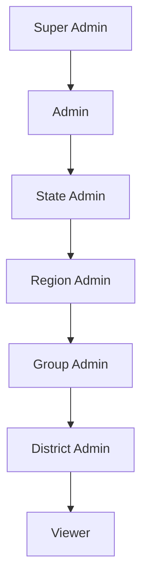

# RBAC Overview

This document describes the strictly enforced 7‑tier RBAC hierarchy, role definitions, inheritance rules, override exceptions, safeguards, compatibility, mobile UX requirements, and verification tests.

## Hierarchy

Roles are ordered from highest to lowest privilege. Permissions cascade top‑down; lower roles never inherit upward.

1. Super Admin
2. Admin
3. State Admin
4. Region Admin
5. Group Admin
6. District Admin
7. Viewer

## Role Definitions

- Super Admin
  - Scope: Full system
  - Capabilities: All CRUD, configuration, security, user management, overrides across tiers
  - Overrides: Can override any subordinate restrictions
- Admin
  - Scope: System‑wide except super‑admin‑only functions (e.g., core security settings, global configs)
  - Capabilities: User and data management, configuration within policy
  - Overrides: May override subordinate tiers except super‑admin‑only boundaries
- State Admin
  - Scope: Assigned state(s)
  - Capabilities: State configuration, regions/groups/districts within state, attendance oversight
  - Overrides: Can override region/group/district within managed state; cannot cross state or system
- Region Admin
  - Scope: Assigned region(s) within a state
  - Capabilities: Regional management for old groups/groups/districts, localized attendance
  - Overrides: Can override group/district within managed region
- Group Admin
  - Scope: Assigned group(s)
  - Capabilities: Group operations, group attendance, district coordination as related
  - Overrides: District only where tied to group operations
- District Admin
  - Scope: Assigned district(s)
  - Capabilities: District operations, district attendance
  - Overrides: None beyond district scope
- Viewer
  - Scope: Read‑only everywhere
  - Capabilities: View dashboards, reports; no mutations
  - Overrides: None

## Inheritance Rules

- Strict cascading: A role inherits all capabilities of roles below it within its scope.
- No upward leakage: Lower roles never gain higher privileges.
- Scope boundaries: Inherited capabilities only apply within assigned scope (state/region/group/district).
- Override exceptions:
  - Super Admin: Global overrides
  - Admin: System‑wide overrides excluding super‑admin‑only
  - State Admin: Overrides inside managed state
  - Region Admin: Overrides inside managed region
  - Group Admin: Overrides limited to group and directly related districts
  - District Admin, Viewer: No overrides

## Enforcement Model

- Pre‑render checks: Components compute `restricted` state from required roles and current user roles.
- Click‑time checks: Handlers block unauthorized actions, show contextual feedback, and log audits.
- Consistent visuals for restricted items: opacity 0.6, cursor not‑allowed, no hover effects, tooltip with required roles.

### Permission Map (examples)

- `/admin/states`: Super Admin, State Admin
- `/admin/regions`: Super Admin, State Admin, Region Admin
- `/admin/old-groups`: Super Admin, State Admin, Region Admin, Group Admin
- `/admin/groups`: Super Admin, State Admin, Region Admin, Group Admin
- `/admin/districts`: Super Admin, State Admin, Region Admin, Group Admin, District Admin
- `/admin/attendance`: Super Admin, State Admin, Region Admin, Group Admin, District Admin
- `/admin/users`: Super Admin, Admin

## Security Safeguards

- Validation checks for assignments:
  - Ensure assigned scopes are valid (state/region/group/district IDs exist and match hierarchy).
  - Prevent assigning roles with scopes outside parent boundaries.
  - Block conflicting multi‑role assignments unless explicitly permitted.
- Automated tests:
  - Unit/integration tests for permission boundaries and inheritance (see Testing).
  - Negative tests for upward leakage and cross‑scope access.
- Audit logging:
  - Log permission changes and unauthorized actions: timestamp, user_id, action, required_permission.
  - Endpoint: `POST /security/audit`

## Compatibility & Migration

- Backward compatibility: Existing role assignments remain valid if they map to the new 7‑tier model.
- Migration path:
  - Map legacy roles to the nearest tier; define any custom overrides per scope.
  - Identify obsolete patterns (e.g., region‑level mutation by viewers) and deprecate.
  - Provide migration scripts or admin tools to reassign roles and scopes.
- Deprecation warnings:
  - Log and surface UI warnings when legacy patterns are detected.
- API enforcement:
  - Endpoints must verify the caller’s role and scope before mutations or sensitive reads.
  - Use consistent middleware or service checks aligned with this hierarchy.

## Mobile Responsiveness

- Navigation:
  - Replace sidebars with Chakra UI `Drawer` for mobile.
  - Maintain consistent UX between desktop and mobile.
- Behavior:
  - Ensure touch‑friendly hit targets, proper focus management, and accessible labels.
  - Test across breakpoints and common devices.

## Verification & Testing

- Permission tests:
  - Coverage for all seven roles across common actions.
  - Verify inheritance (top‑down) and edge cases (override exceptions, scope limits).
- Boundary tests:
  - Unauthorized clicks blocked with UI feedback and audit logging.
  - Cross‑scope access denied.
- Mobile tests:
  - Drawer navigation usability, focus traps, screen reader labels.
  - Breakpoint layout consistency.
- Accessibility:
  - Keyboard navigation, ARIA roles, color contrast, tooltip semantics.

## Dynamic Titles Pattern

- Set page title with app name:
  - `const title = useMemo(() => `${PageName} | ${ENV.APP_NAME}`, [ENV.APP_NAME])`
  - Render: `<title>{title}</title>`
